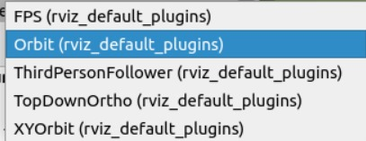
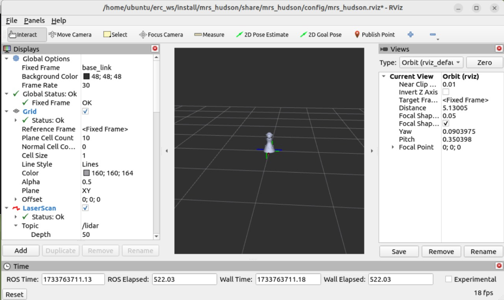
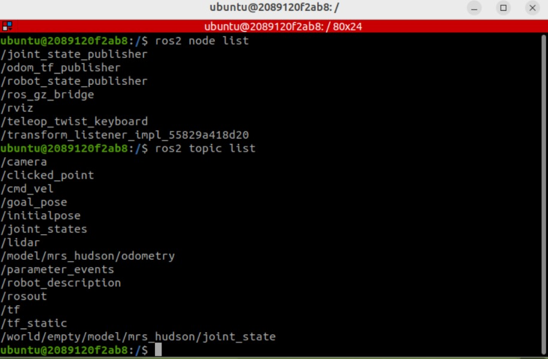
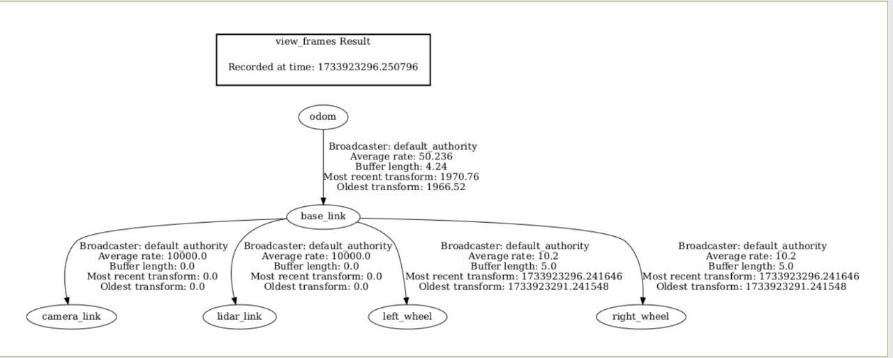

# Episode 1 - The Blind Bot

## Introduction

If you have gone through the content of Week 0 and tried the problem, you should be familiar with the basic ideas of ROS. In addition, you should be capable enough of creating a simple publisher and a subscriber. If so, you are ready to face what is about to come your way. In this episode, you will see how to work in **Gazebo** and **Rviz**.

 

You will also get to play with the **Mrs_Hudson** in Gazebo and see the working of its sensors in Rviz2.


Let's begin !

## Table of Contents

<ol>
  <li><a href="#Gazebo">Gaze at Gazebo...</a></li>
  <li><a href="#Rviz">Viziting Rviz...</a></li>
  <li><a href="#mrs_hudson">mrs_hudson emerges...</a></li>
</ol>

## Initial preparation

Create a package `week1_tutorials` in `erc_ws` directory. This will be required for storing the various files that will be created throughout. Recall how to make a package from Episode 0.
Create `launch`, `models`, `worlds` and `configs` folder in week1_tutorials package (using the mkdir command).

## Gaze at Gazebo... <a name="Gazebo"></a>

### What is it ?

Gazebo is a **robotics simulator** that is capable of simulating **dynamical systems** in various **realistic scenarios and environments**.
This is useful for testing algorithms and designing robots before actually implementing in the real physical world. We will be using Gazebo Fortress. Docker provides pre-installed Gazebo (or Ignition Gazebo) containers, which are convenient for running Gazebo simulations. 

### Checking if Gazebo is present: 

```bash
ign gazebo --versions
```
If Ignition Gazebo is installed, this will display the version number of Gazebo and its components. If you cant find it , then you can install it manually as shown below:

### Installing Gazebo

install some necessary tools:

```bash
sudo apt-get update
sudo apt-get install lsb-release wget gnupg
```

Then install Ignition Fortress:

```bash
sudo wget https://packages.osrfoundation.org/gazebo.gpg -O /usr/share/keyrings/pkgs-osrf-archive-keyring.gpg
echo "deb [arch=$(dpkg --print-architecture) signed-by=/usr/share/keyrings/pkgs-osrf-archive-keyring.gpg] http://packages.osrfoundation.org/gazebo/ubuntu-stable $(lsb_release -cs) main" | sudo tee /etc/apt/sources.list.d/gazebo-stable.list > /dev/null
sudo apt-get update
sudo apt-get install ignition-fortress
```

Launch Gazebo Sim, a 3D robotics simulator, from a terminal by running:

```bash
ign gazebo sim shapes.sdf
```


Welcome to Gazebo !

### Basic features

Refer to the following link to know about the basic GUI features of Gazebo.

[Understanding the GUI](https://gazebosim.org/docs/harmonic/gui)

### Manipulating Models : The Transform Control

The top left toolbar contains controls for transforming.

1. Open Gazebo
2. The View Angle plugin allows you to quickly and easily adjust the direction from which your scene faces an entity in the simulation.
3. The Component Inspector plugin displays a variety of object attributes.

4. The Align Tool aligns entities along or about a specific entity's bounding box.

5. Select Mode: Click to select entities in the scene. It is the default mode. To select multiple entities, hold `Ctrl` and click. Entities can't be manipulated in select mode.
   You can always return to selection mode from any other mode by pressing Esc.

   

6. Translate Mode: Allows to translate entities along the x, y and z axes.(Shortcut `T`)

   

   

7. Rotate Mode: Allows to rotate entities around the roll, pitch and yaw axes of rotation.(Shortcut `R`)

   

   

### Keyboard Shortcuts


### Building your own Robot

##### SDF

SDFormat (Simulation Description Format), sometimes abbreviated as SDF, is an XML format that describes objects and environments for robot simulators, visualization, and control.

We will start by building a simple world and then build our robot in it. In the week1_tutorials package go to the models directory, Make a new file called cub_world.sdf and copy the following code to it ( rememeber how you created turtlesim_mimic_launch.py in episode 0 ).

```bash
<?xml version="1.0" ?>
<sdf version="1.8">
    <world name="cub_world">
        <physics name="1ms" type="ignored">
            <max_step_size>0.001</max_step_size>
            <real_time_factor>1.0</real_time_factor>
        </physics>
        <plugin
            filename="libignition-gazebo-physics-system.so"
            name="ignition::gazebo::systems::Physics">
        </plugin>
        <plugin
            filename="libignition-gazebo-user-commands-system.so"
            name="ignition::gazebo::systems::UserCommands">
        </plugin>
        <plugin
            filename="libignition-gazebo-scene-broadcaster-system.so"
            name="ignition::gazebo::systems::SceneBroadcaster">
        </plugin>

        <light type="directional" name="sun">
            <cast_shadows>true</cast_shadows>
            <pose>0 0 10 0 0 0</pose>
            <diffuse>0.8 0.8 0.8 1</diffuse>
            <specular>0.2 0.2 0.2 1</specular>
            <attenuation>
                <range>1000</range>
                <constant>0.9</constant>
                <linear>0.01</linear>
                <quadratic>0.001</quadratic>
            </attenuation>
            <direction>-0.5 0.1 -0.9</direction>
        </light>

        <model name="ground_plane">
            <static>true</static>
            <link name="link">
                <collision name="collision">
                <geometry>
                    <plane>
                    <normal>0 0 1</normal>
                    </plane>
                </geometry>
                </collision>
                <visual name="visual">
                <geometry>
                    <plane>
                    <normal>0 0 1</normal>
                    <size>100 100</size>
                    </plane>
                </geometry>
                <material>
                    <ambient>0.8 0.8 0.8 1</ambient>
                    <diffuse>0.8 0.8 0.8 1</diffuse>
                    <specular>0.8 0.8 0.8 1</specular>
                </material>
                </visual>
            </link>
        </model>
    </world>
</sdf>
```

Save the file cub_world.sdf, navigate to the models directory and launch the simulator:

`ign gazebo cub_world.sdf`

### Building a cuboidal box

Open the cub_world.sdf file. Inside the world tag we will add our cuboid model as follows (Paste the snippets one below the other):

```bash
<model name='cuboidal_model' canonical_link='cuboid'>
    <pose relative_to='world'>0 0 0 0 0 0</pose>
```

Every model is a group of links (can be just one link) connected together with joints.

```bash
 <link name='cuboid'>
        <pose relative_to='__model__'>0.5 0 0.4 0 0 0</pose>
```

Inertial properties

```bash
  <inertial> <!--inertial properties of the link mass, inertia matix-->
        <mass>1.14395</mass>
        <inertia>
            <ixx>0.095329</ixx>
            <ixy>0</ixy>
            <ixz>0</ixz>
            <iyy>0.381317</iyy>
            <iyz>0</iyz>
            <izz>0.476646</izz>
        </inertia>
    </inertial>
```

Visual

```bash
    <visual name='visual'>
        <geometry>
            <box>
                <size>2.0 1.0 0.5</size>
            </box>
        </geometry>
        <!--let's add color to our link-->
        <material>
            <ambient>0.0 0.0 1.0 1</ambient>
            <diffuse>0.0 0.0 1.0 1</diffuse>
            <specular>0.0 0.0 1.0 1</specular>
        </material>
    </visual>
```

Collision

```bash
        <collision name='collision'>
            <geometry>
                <box>
                    <size>2.0 1.0 0.5</size>
                </box>
            </geometry>
        </collision>
    </link>
</model>
```

After copying all the parts above into the world file in order, run the world again by the following command:

`ign gazebo cub_world.sdf`

### Spawning models using launch file

If you want to spawn the models when launching gazebo world. Make a launch file `cub.launch.py` in the launch folder in the package and add the following code

```py
from launch import LaunchDescription
from launch_ros.actions import Node
import os
from launch.actions import DeclareLaunchArgument
from launch.actions import IncludeLaunchDescription
from launch.conditions import IfCondition
from launch.launch_description_sources import PythonLaunchDescriptionSource
from launch.substitutions import LaunchConfiguration, PathJoinSubstitution
from ament_index_python.packages import get_package_share_directory

def generate_launch_description():

	pkg_project = get_package_share_directory('week1_tutorials')
	pkg_ros_gz_sim = get_package_share_directory('ros_gz_sim')

	gz_sim = IncludeLaunchDescription(
        PythonLaunchDescriptionSource(
            os.path.join(pkg_ros_gz_sim, 'launch', 'gz_sim.launch.py')),
        launch_arguments={'gz_args': os.path.join(pkg_project, 'models', 'cub_world.sdf')}.items(),
    	)

	bridge = Node(
        package='ros_gz_bridge',
        executable='parameter_bridge',
        arguments=['/world/empty/model/cub_world/joint_state@sensor_msgs/msg/JointState@ignition.msgs.Model',
    				'/clock@rosgraph_msgs/Clock@ignition.msgs.Clock'],
        output='screen'
    )

	return LaunchDescription([
		gz_sim,
		bridge
		])
```

Now add the following line in `setup.py` in the `data_files`

```python
(os.path.join('share', package_name, 'models'), glob(os.path.join('models', 'cub_world.sdf'))),
(os.path.join('share', package_name, 'launch'), glob(os.path.join('launch', 'cub.launch.py'))),
```

and add the follwing on the top of `setup.py`

```python
import os
from glob import glob
```

Now, go to erc_ws directory and build the package:

```bash
colcon build
source install/setup.bash
```

If your package doesn't get build, and shows some "package not found error" then you can try running the following commands:

```bash
sudo apt install ros-humble-ros-gz
sudo apt install ros-humble-ros-gz-sim

sudo apt upgrade
ros2 pkg list | grep ros_gz_sim   ## shows ros_gz_sim  ros_gz_sim_demos
```
Once your package is build successfully, we are ready to launch! 
from the same erc_ws directory run   `ros2 launch week1_tutorials cub.launch.py`

### What are Plugins ?

Plugins are a dynamically loaded chunk of code. For example:

```bash
<plugin
    filename="libignition-gazebo-physics-system.so"
    name="ignition::gazebo::systems::Physics">
</plugin>
```

The `Physics` plugin is very important for simulating the dynamics of the world.

```bash
<plugin
    filename="libignition-gazebo-user-commands-system.so"
    name="ignition::gazebo::systems::UserCommands">
</plugin>
```

The `UserCommands` plugin is responsible for creating models, moving models, deleting them and many other user commands.

```bash
<plugin
    filename="libignition-gazebo-scene-broadcaster-system.so"
    name="ignition::gazebo::systems::SceneBroadcaster">
</plugin>
```

`SceneBroadcaster` shows our world scene.

## Viziting Rviz2... <a name="Rviz"></a>

### What is it ?

Rviz2 is a **3D visualizer** for **ROS** that lets us view a lot about the **sensing**, **processing** and **state** of a robot.
This makes the **development** of robots easier and also enables us to **debug** more efficiently (better than looking at numbers on a terminal :P)

### What is the difference between Rviz2 and Gazebo ?

Rviz2 is a **visualizer** i.e it shows what the robot **perceives** is happening while Gazebo is a **simulator** i.e. it shows what is **actually** happening.

Consider the scenario in which we do not have physical hardware-based robots. In that case we would use a simulator like Gazebo to know what would actually happen and the data from the sensors can be visualized in a visualization tool like Rviz2. In case we have physical robots, then the data from the sensors can still be visualized in Rviz, but we do not need a simulator necessarily.

### Installation

Execute the following command

```
sudo apt-get install ros-humble-rviz2
```

### Starting Rviz

```
rviz2
```

Upon execution, the following screen should appear.


Welcome to Rviz2 !

### Basic features

1. **Displays** - The Display Tab in RViz2 allows you to manage and customize different visualizations of ROS 2 data.
   
##### Tree Structure: Lists active displays like LaserScan, PointCloud, TF, etc., with expandable properties.

##### Add Displays: Add new visualizations by selecting from a list of types (e.g., Map, Image, Odometry).

##### Properties Panel: Customize each display’s settings, such as topics, styles, and reference frames.

##### Enable/Disable Displays: Use checkboxes to toggle displays on/off without removing them.

##### Fixed Frame: Sets a reference frame (e.g., map or odom) for all visualizations.

##### Common Displays: Include Grid, TF, MarkerArray, Path, and RobotModel.

It’s a flexible tool to visualize, debug, and analyze robotic data efficiently.


Using the **Add** button, we can add additional displays.


2. **Camera types** - These are ways of viewing the world from different angles and projections.



3. **Configurations** - These are combinations of displays, camera types, etc that define the overall layout of what and how the visualization is taking place in the rviz window.

### Saving and Loading configurations

Currently the default layout of the Rviz window is similar to the picture below


Say we are interested in saving a configuration consisting of additional displays such as LaserScan as well as a different camera type. How do we accomplish that ?

1. Add the required displays and change the camera type


2. To save the configuration,

   2.1) Go to **File > Save Config As (Ctrl + Shift + S)**

   2.2) Go to the appropriate folder (`week1_tutorials > configs`), give an appropriate name (`custom`) and save

3. To load the configuration at a later time,

   3.1) Go to **File > Open Config (Ctrl + O)**

   3.2) Go to the appropriate folder (`week1_tutorials > configs`) and select the config file (`custom`)

### Starting Rviz2 through Launch files

Create `custom_rviz.launch.py` in the `launch` folder

Add the following code to launch Rviz with `custom.rviz` configuration

```python
from launch import LaunchDescription
from ament_index_python.packages import get_package_share_directory
from launch_ros.actions import Node
import os.path

def generate_launch_description():
    pkg_project = get_package_share_directory('week1_tutorials')
    return LaunchDescription([
        Node(
            package='rviz2',
            namespace='',
            executable='rviz2',
            name='rviz2',
            arguments=['-d', os.path.join(pkg_project, 'config', 'custom.rviz')]
        )
    ])
```

Now add the following line in `setup.py` in the `data_files`

```python
(os.path.join('share', package_name, 'config'), glob(os.path.join('config', 'custom.rviz'))),
(os.path.join('share', package_name, 'launch'), glob(os.path.join('launch', 'custom_rviz.launch.py'))),
```

After adding these lines in setup files, save the file. Come to erc_ws directory. Run the following commands.

```bash
colcon build
source install/setup.bash
```

After `colcon build` from workspace, Run `ros2 launch week1_tutorials custom_rviz.launch` , Rviz will be launched with the desired configuration.

## ros_gz

ros_gz is a collection of packages that integrate ROS and Gazebo, enabling seamless communication between the two platforms. It provides features like bidirectional data exchange, image transport, point cloud publishing, and convenient tools for easy setup and use. By simulating robots in a virtual environment, ros_gz accelerates development, enhances debugging, and expands the possibilities of ROS-based robotics.

To install add https://packages.ros.org

```bash
 sudo sh -c 'echo "deb [arch=$(dpkg --print-architecture)] http://packages.ros.org/ros2/ubuntu $(lsb_release -cs) main" > /etc/apt/sources.list.d/ros2-latest.list'
 curl -s https://raw.githubusercontent.com/ros/rosdistro/master/ros.asc | sudo apt-key add -
 sudo apt-get update
```

Install `ros_gz`

```bash
 sudo apt install ros-humble-ros-gz
```

## mrs_hudson emerges... <a name="mrs_hudson"></a>

Meet mrs_hudson, our Sherlock-themed bot for hands-on ROS, Gazebo, and Rviz exploration. You'll find meticulously crafted URDF and launch files, enabling seamless integration for accomplishing investigations and unfolding mysteries

## Installing mrs_hudson

For cloning the `mrs_hudson` repo you need to have git installed on your system

```bash
sudo apt-get install git
```

Then go to the `erc_ws/src` directory and open the terminal and run

```bash
git clone https://github.com/erciitb/mrs_hudson.git
```

Now before building the package with `colcon build` first we need to change the path of meshes in the urdf and sdf files.
In the models and world folder, you will see the urdf and sdf files respectively. In both files, update the path of the meshes according to their locations in your system.

If you are using docker as per our instructions, You all will have a same directory address given by "file:///home/ubuntu/erc_ws/src/mrs_hudson/meshes/". So You don't need to change any path. To be safer, crosscheck the address of one of your stl files.

For those using any other way of running linux or Any other folders as their workspace:

Use a simple find and replace, eg:

find = "file:///home/ubuntu/erc_ws/src/mrs_hudson/meshes/"

replace with repective addresses of base_link.stl , left_wheel.stl and right_wheel.stl in your system (Easy way to know: just go to the mrs_hudson folder you cloned, then meshes folder, copy the address of stl files). Make sure to not mess up with these, also do check if it was previously right_wheel.stl address then the new address which you are updating should be of right_wheel.stl and not any other stl file. else you get a error :)

Do these replacements in both urdf and sdf files, crosscheck all when you are done.

Then run `colcon build` in the workspace.

You can visit the [mrs_hudson repo](https://github.com/erciitb/mrs_hudson.git) on the ERC GitHub page.

Henceforth, the **mrs_hudson** may be referred to as **bot** simply, unless specified.

Let us see the bot in action in Gazebo!

## Launching mrs_hudson in Gazebo

To summon the bot in an **empty world** in **Gazebo**, execute the following command in the erc_ws directory.

```
ros2 launch mrs_hudson mrs_hudson_empty_world.launch.py
```

## Visualizing the bot


#### Installing joint_state_publisher
```bash
sudo apt update
sudo apt install ros-humble-joint-state-publisher
```

### Installing robot_state_publisher
```bash
sudo apt update
sudo apt install ros-humble-robot-state-publisher
```

To visualize mrs hudson in **Gazebo** & **Rviz**, run the following command from erc_ws directory in a new terminal 

```
ros2 launch mrs_hudson mrs_hudson_gazebo_rviz.launch.py
```
You will be able to see Mrs. Hudson model on the rviz screen. 
If there is some error related to joint and robot state publisher, then : 
To make sure all the nodes are working properly, we will be launching the robot_state-publisher and joint_state_publisher manually in different terminals. 
```bash
ros2 run robot_state_publisher robot_state_publisher /home/ubuntu/erc_ws/src/mrs_hudson/models/mrs_hudson.urdf
```
replace `/home/ubuntu/erc_ws/src/mrs_hudson/models/mrs_hudson.urdf` with address of urdf file in your system. 

```bash
ros2 run joint_state_publisher joint_state_publisher --ros-args -p robot_description:="file:///home/ubuntu/erc_ws/src/mrs_hudson/models/mrs_hudson.urdf"
```
This will start the joint_state_pubisher. 

Now, you will be able see Mrs. Hudson as shown below:


Check the following things on your rviz:

-If in the display section, You can't see TF and RobotModel, then , Below the display Section, There is the Add button, click on it and add 'RobotModel' and 'TF' to your display. 

-In the fixed Frame, check if you have selected `/base_link`, as shown in previous image.


## Taking a peek at the mrs_hudson topics

After launching the mrs_hudson in Gazebo, execute `ros2 topic list` in another tab.

The expected output is as follows

```
/camera
/clicked_point
/cmd_vel
/goal_pose
/initialpose
/joint_states
/lidar
/model/mrs_hudson/odometry
/parameter_events
/robot_description
/rosout
/tf
/tf_static
/world/empty/model/mrs_hudson/joint_state

```


## Moving the bot around in Gazebo

Let's move the bot around in the standard world in Gazebo using the `mrs_hudson_teleop` script

The Turtlebot3 motion is described by its **linear velocity** and **angular velocity**. The ratio of the instantaneous linear velocity to the instantaneous angular velocity gives the **radius of curvature** of the arc it traverses at the instant.

First launch the bot in gazebo using the launch file then open a new terminal in the erc_ws directory and run the following command

```
ros2 run mrs_hudson mrs_hudson_teleop
```

we get the ability to control the linear velocity and the angular velocity of the bot using the appropriate keys as displayed on the screen.

```bash
Reading from the keyboard  and Publishing to Twist!
---------------------------
Moving around:
   u    i    o
   j    k    l
   m    ,    .

For Holonomic mode (strafing), hold down the shift key:
---------------------------
   U    I    O
   J    K    L
   M    <    >

t : up (+z)
b : down (-z)

anything else : stop

q/z : increase/decrease max speeds by 10%
w/x : increase/decrease only linear speed by 10%
e/c : increase/decrease only angular speed by 10%

CTRL-C to quit
```

One might quickly realize that moving the bot with the keys is kind of annoying.

Let's see another way of moving the bot around using a publisher that will publish velocity commands to the `/cmd_vel` topic. For simplicity, we shall make it go with a constant speed in a circular path to give the basic idea.

#### Knowing the message type

How do we know the type of message that needs to be published into `/cmd_vel` ? Well, on launching the bot in Gazebo, execute the following command in a new tab

`ros2 topic info /cmd_vel`

The expected output is `geometry_msgs/Twist`

To inspect the nature of this message type, execute the following command

`ros2 interface show geometry_msgs/msg/Twist`

The expected output is

```
geometry_msgs/Vector3 linear
  float64 x
  float64 y
  float64 z
geometry_msgs/Vector3 angular
  float64 x
  float64 y
  float64 z
```

Once we know the features of the message we are dealing with, we can proceed with the code for moving the bot.

```bash
ros2 run mrs_hudson vel_pub
```

The bot begins to move in a line. Cool!


### Moving the bot around in both rviz2 and gazebo
In ROS 2, the odom topic is crucial for simulating bot motion in RViz2. It provides real-time data on the robot's position, orientation, and velocity relative to its starting point. This information allows RViz2 to visualize the robot's movement accurately in a simulated environment, aiding in tasks like navigation, motion planning, and debugging. Additionally, odom integrates with mapping and localization systems like SLAM, offering incremental updates that improve the realism and reliability of the simulation.

So firstly, we will make the odom_tf_publisher package. 
Open a new Terminal, go to erc_ws/src directory.
```bash
ros2 pkg create --build-type ament_python odom_tf_publisher
cd odom_tf_publisher
```
Then we create a odom_tf_publisher.py file in the erc_ws/src/odom_tf_publisher/odom_tf_publisher folder using the below commands.

```bash
touch odom_tf_publisher.py
chmod +x odom_tf_publisher.py
```
write `codium .` or `code .` in the terminal, then in odom_tf_publisher.py paste the followoing code:

```bash
import rclpy
from rclpy.node import Node
from nav_msgs.msg import Odometry
from geometry_msgs.msg import TransformStamped
from tf2_ros import TransformBroadcaster

class OdomTFPublisher(Node):
    def __init__(self):
        super().__init__('odom_tf_publisher')
        self.subscription = self.create_subscription(
            Odometry,
            '/model/mrs_hudson/odometry',  # Replace with your odometry topic
            self.odom_callback,
            10)
        self.tf_broadcaster = TransformBroadcaster(self)

    def odom_callback(self, msg):
        t = TransformStamped()
        t.header.stamp = msg.header.stamp
        t.header.frame_id = "odom"  # Set to your odom frame
        t.child_frame_id = "base_link"  # Set to your robot's base link
        t.transform.translation.x = msg.pose.pose.position.x
        t.transform.translation.y = msg.pose.pose.position.y
        t.transform.translation.z = msg.pose.pose.position.z
        t.transform.rotation = msg.pose.pose.orientation

        self.tf_broadcaster.sendTransform(t)

def main():
    rclpy.init()
    node = OdomTFPublisher()
    rclpy.spin(node)
    rclpy.shutdown()

if __name__ == '__main__':
    main()

```
Save the code to file. Now edit the setup.py file of the package 
```bash
entry_points={
    'console_scripts': [
        'odom_tf_publisher = odom_tf_publisher.odom_tf_publisher:main',
    ],
},
```

Now, form the erc_ws directory,  build the package using `colcon build` and then `source ~/erc_ws/install/setup.bash  # Replace with your workspace path`
After we have successfully build and sourced, we will run the package using the below command. 
```bash
ros2 run odom_tf_publisher odom_tf_publisher
```
You won't see any output on the terminal when its running. 

##### Launch

Launch the gazebo-Rviz2 launch file:
```bash
ros2 launch mrs_hudson mrs_hudson_gazebo_rviz.launch.py
```

Check if you have RobotModel and TF displays added to your Display section, if not then add them. We will add the Odometry from the displays add section. 
In the topic name for odometry, click on the drop-down option it will show you you /models/mrs_hudsom/odometry , select it, press Enter. 
If you have the RobotModel name as empty, then you have to set it as `/robot_description`.
For the Fixed Frame at the top, type `/odom` and press enter. 

Now for the movement, we will launch the teleop, 
```bash
ros2 run mrs_hudson mrs_hudson_teleop
```
Now, make sure to start the Gazebo play button, and press the respective keys in the teleop terminal, you will be able to see the motion of our bot in both Gazebo and Rviz2 at the same time. 
Checking for nodes and topics:

If any of the nodes is missing, it may lead to an error in executing the stimulation. 


### tf2
tf2 in ROS 2 is a library that manages coordinate frame transformations, helping robots understand the spatial relationships between different parts of themselves and their environment. It allows for seamless conversion of data between various coordinate frames, such as from a sensor frame to the robot's base frame, while considering both spatial and temporal aspects. tf2 organizes these frames into a tree structure, ensuring real-time updates and consistent transformations, even for moving objects or robots. It is essential for tasks like navigation, manipulation, and sensor fusion, making it a core tool for robotics applications in ROS 2.

while your rviz2 and gazebo is working, To view the tree structure for your bot, you can run the following command from erc_ws directory, on successful execution, a pdf file will be generated in the erc_ws/directory. 
```bash
ros2 run tf2_tools view_frames
```
This will generate a pdf of the tree structure. Something like as shown below:

<video controls>
  <source src="W1_Images/Rviz_motion.mp4" type="video/mp4">
  
</video>


## Investigation

Take a look at the code in `mrs_hudson_empty_world.launch.py`, `mrs_hudson_gazebo_rviz.launch.py` and `mrs_hudson_teleop.py`. It will be helpful for the upcoming sections as the commands in these files will be used more or less directly with slight modification to launch the bots.


mrs_hudson_empty_world.launch.py:

```python
from launch import LaunchDescription
from launch_ros.actions import Node
import os
from launch.actions import DeclareLaunchArgument
from launch.actions import IncludeLaunchDescription
from launch.conditions import IfCondition
from launch.launch_description_sources import PythonLaunchDescriptionSource
from launch.substitutions import LaunchConfiguration, PathJoinSubstitution
from ament_index_python.packages import get_package_share_directory

def generate_launch_description():

	pkg_project = get_package_share_directory('mrs_hudson')
	pkg_ros_gz_sim = get_package_share_directory('ros_gz_sim')

	gz_sim = IncludeLaunchDescription(
        PythonLaunchDescriptionSource(
            os.path.join(pkg_ros_gz_sim, 'launch', 'gz_sim.launch.py')),
        launch_arguments={'gz_args': os.path.join(pkg_project, 'worlds', 'mrs_hudson.sdf')}.items(),
    	)

	bridge = Node(
        package='ros_gz_bridge',
        executable='parameter_bridge',
        arguments=['/cmd_vel@geometry_msgs/msg/Twist@gz.msgs.Twist',
                   '/model/mrs_hudson/odometry@nav_msgs/msg/Odometry@gz.msgs.Odometry',
                   '/world/empty/model/mrs_hudson/joint_state@sensor_msgs/msg/JointState@ignition.msgs.Model',
                   'lidar@sensor_msgs/msg/LaserScan@gz.msgs.LaserScan',
                   ],
        output='screen'
    )

	return LaunchDescription([
		gz_sim,
		bridge
		])
```

mrs_hudson_gazebo_rviz.launch.py`

```python
from launch import LaunchDescription
from launch_ros.actions import Node
import os
from launch.actions import DeclareLaunchArgument
from launch.actions import IncludeLaunchDescription
from launch.conditions import IfCondition
from launch.launch_description_sources import PythonLaunchDescriptionSource
from launch.substitutions import LaunchConfiguration, PathJoinSubstitution
from ament_index_python.packages import get_package_share_directory

def generate_launch_description():
    pkg_project = get_package_share_directory('mrs_hudson')
    pkg_ros_gz_sim = get_package_share_directory('ros_gz_sim')
    sdf_file = os.path.join(pkg_project, 'models', 'mrs_hudson.urdf')
    with open(sdf_file, 'r') as infp:
        robot_desc = infp.read()   
    
    use_sim_time = LaunchConfiguration('use_sim_time')
        
    # Parameters for the nodes
    params = {'robot_description': robot_desc, 'use_sim_time': use_sim_time}

    # Node for robot_state_publisher
    node_robot_state_publisher = Node(
        package='robot_state_publisher',
        executable='robot_state_publisher',
        output='screen',
        parameters=[params]
    )

    # Node for joint_state_publisher
    node_joint_state_publisher = Node(
        package='joint_state_publisher',
        executable='joint_state_publisher',
        output='screen',
        parameters=[params]
    )

    # Gazebo simulation node
    gz_sim = IncludeLaunchDescription(
        PythonLaunchDescriptionSource(
            os.path.join(pkg_ros_gz_sim, 'launch', 'gz_sim.launch.py')),
        launch_arguments={'gz_args': os.path.join(pkg_project, 'worlds', 'mrs_hudson.sdf')}.items(),
    )
    
    # Bridge for communication between ROS 2 and Gazebo
    bridge = Node(
        package='ros_gz_bridge',
        executable='parameter_bridge',
        arguments=['/cmd_vel@geometry_msgs/msg/Twist@gz.msgs.Twist',
                   '/model/mrs_hudson/odometry@nav_msgs/msg/Odometry@gz.msgs.Odometry',
                   '/world/empty/model/mrs_hudson/joint_state@sensor_msgs/msg/JointState@ignition.msgs.Model',
                   '/lidar@sensor_msgs/msg/LaserScan@gz.msgs.LaserScan',
                   '/camera@sensor_msgs/msg/Image@gz.msgs.Image',
                   ],
        output='screen'
    )

    # RViz node for visualization
    rviz = Node(
        package='rviz2',
        executable='rviz2',
        arguments=['-d', os.path.join(pkg_project, 'config', 'mrs_hudson.rviz')],
    )	        

    return LaunchDescription([
        DeclareLaunchArgument(
            'use_sim_time',
            default_value='false',
            description='Use sim time if true'),
        node_robot_state_publisher,
        node_joint_state_publisher,  # Add joint_state_publisher here
        rviz,	            
        gz_sim,
        bridge
    ])

```

mrs_hudson_teleop.py

```python
import rclpy
from geometry_msgs.msg import Twist
import sys, select, termios, tty

settings = termios.tcgetattr(sys.stdin)

msg = """
Reading from the keyboard  and Publishing to Twist!
---------------------------
Moving around:
   u    i    o
   j    k    l
   m    ,    .

For Holonomic mode (strafing), hold down the shift key:
---------------------------
   U    I    O
   J    K    L
   M    <    >

t : up (+z)
b : down (-z)

anything else : stop

q/z : increase/decrease max speeds by 10%
w/x : increase/decrease only linear speed by 10%
e/c : increase/decrease only angular speed by 10%

CTRL-C to quit
"""

moveBindings = {
        'i':(1,0,0,0),
        'o':(1,0,0,-1),
        'j':(0,0,0,1),
        'l':(0,0,0,-1),
        'u':(1,0,0,1),
        ',':(-1,0,0,0),
        '.':(-1,0,0,1),
        'm':(-1,0,0,-1),
        'O':(1,-1,0,0),
        'I':(1,0,0,0),
        'J':(0,1,0,0),
        'L':(0,-1,0,0),
        'U':(1,1,0,0),
        '<':(-1,0,0,0),
        '>':(-1,-1,0,0),
        'M':(-1,1,0,0),
        't':(0,0,1,0),
        'b':(0,0,-1,0),
           }

speedBindings={
        'q':(1.1,1.1),
        'z':(.9,.9),
        'w':(1.1,1),
        'x':(.9,1),
        'e':(1,1.1),
        'c':(1,.9),
          }

def getKey():
    tty.setraw(sys.stdin.fileno())
    select.select([sys.stdin], [], [], 0)
    key = sys.stdin.read(1)
    termios.tcsetattr(sys.stdin, termios.TCSADRAIN, settings)
    return key


def vels(speed,turn):
    return "currently:\tspeed %s\tturn %s " % (speed,turn)

def main(args=None):
    if args is None:
        args = sys.argv

    rclpy.init(args=args)
    node = rclpy.create_node('teleop_twist_keyboard')

    pub = node.create_publisher(Twist, 'cmd_vel', 10)

    speed = 0.5
    turn = 1.0
    x = 0
    y = 0
    z = 0
    th = 0
    status = 0

    try:
        print(msg)
        print(vels(speed,turn))
        while(1):
            key = getKey()
            if key in moveBindings.keys():
                x = moveBindings[key][0]
                y = moveBindings[key][1]
                z = moveBindings[key][2]
                th = moveBindings[key][3]
            elif key in speedBindings.keys():
                speed = speed * speedBindings[key][0]
                turn = turn * speedBindings[key][1]

                print(vels(speed,turn))
                if (status == 14):
                    print(msg)
                status = (status + 1) % 15
            else:
                x = 0
                y = 0
                z = 0
                th = 0
                if (key == '\x03'):
                    break

            twist = Twist()
            twist.linear.x = x*speed; twist.linear.y = y*speed; twist.linear.z = z*speed;
            twist.angular.x = 0.0; twist.angular.y = 0.0; twist.angular.z = th*turn
            pub.publish(twist)

    except:
        print(e)

    finally:
        twist = Twist()
        twist.linear.x = 0.0; twist.linear.y = 0.0; twist.linear.z = 0.0
        twist.angular.x = 0.0; twist.angular.y = 0.0; twist.angular.z = 0.0
        pub.publish(twist)

        termios.tcsetattr(sys.stdin, termios.TCSADRAIN, settings)
```


## Lidar & mrs_hudson

Git clone the latest mrs_hudson package and then explore about lidar of the bot.

Launch mrs_hudson using the `mrs_hudson_gazebo_rviz.launch.py` and observe the lidar data in rviz by moving the bot using the `teleop` script and adding some obstacles like cubes in the sdf file. :) just see how we spawn the cuboid in the empty world.

For observing the lidar in gazebo you can search lidar in gazebo and the click on it to observe the lidar. And for echoing lidar messages use:

```bash
ign topic -e -t /lidar
```

PS: See the `mrs_hudson_arena.sdf` provided for the assignment for better understanding of the lidar.

## Way ahead

Now that you have gained the ability to write code to move the bot around and sense the surroundings, what you can do with the bot is restricted only by your imagination.

Try to know more about the mrs_hudson and explore various capabilities like navigation and SLAM by refering to blogs and documentations online.

Additionally, one can try writing code for publishers and subscribers in different ways apart from the prescribed style, such as using **classes**. We shall leave that up to you for exploration. Have fun.

# Let's play a game, shall we ...

Coming soon :) 

